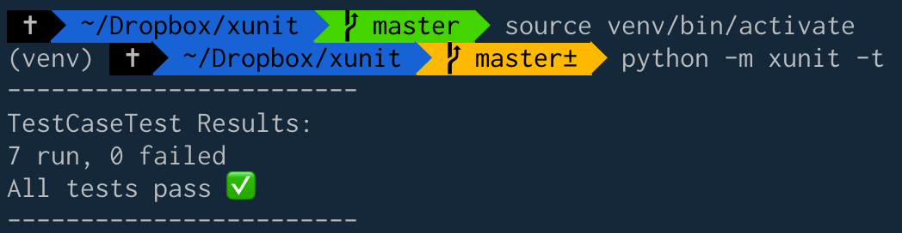

# xUnit - TDD II

Use native assertions to implement TDD while building a testing framework.

## Usage

If adding non-test items to xunit folder, run app with `python -m xunit`.

To add tests, add to `tests.py` ensuring to inherit the TestCase and registering the suite with the metaclass. All methods beginning with `test` will be run. You can perform setup and teardown by overriding the TestCase default `setup()` and `teardown()` methods.

```python
# tests.py

class NameForTestSuite(TestCase, metaclass=Suite):
    def setup(self):
        # optional setup routine

    def test_something(self):
        ...
        assert expression

    def teardown(self):
        # optional teardown routine
```

All tests in `tests.py` can then be run adding the test flag: `python -m xunit -t` or `--test`.



### Note

If cloning, set up a new virtual environment before using:
```bash
$ ~/path/to/xunit rm -r -f venv .vscode
$ ~/path/to/xunit python3 -m venv venv
$ ~/path/to/xunit source venv/bin/activate #for POSIX - zsh/bsh
```

#### TODO

- [X] Invoke test method
- [X] Invoke test setup first
- [X] Invoke tearDown afterward
- [X] Invoke tearDown even if test method fails
- [X] Run multiple tests
- [X] Report collected results
- [X] Log string methods called in WasRun
- [X] Report failed tests
- [X] Catch and report setup errors
- [X] Create TestSuite from a TestCase class
